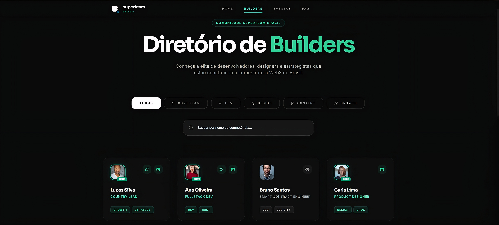

# Superteam Brazil – Landing Page & Members Directory Design 🇧🇷

Premium Figma design created for **Superteam Brazil**, positioning the community as the main hub for **Solana builders in Brazil** and a strategic bridge between Latin America and the global Superteam ecosystem.

---

## 🔗 Links

- **Figma Design (View Only):** [Link](https://www.figma.com/design/8sth9uoPtdt8CWWzn7PwyC/Superteam-Brasil-LP-Project?node-id=0-1&t=IZziizMfRRvWWnt9-1)
- **Interactive Prototype:** [Link](https://www.figma.com/proto/8sth9uoPtdt8CWWzn7PwyC/Superteam-Brasil-LP-Project?node-id=0-1&t=IZziizMfRRvWWnt9-1)
- **Design Rationale / Presentation:**[Link](https://www.notion.so/Superteam-Brazil-Design-Rationale-2f9aedf9141380df8561ea92c9e76bcc?source=copy_link)
- **Announcement / Submission Post:** seu-link-aqui  

---

## 🎨 Design Approach

Dark-mode Web3 interface designed to balance a **strong Brazilian identity** with **strict alignment to Superteam’s global brand standards**.

The visual system follows established Superteam references (UAE, France, Germany, Vietnam), ensuring consistency across regions, while introducing localized Brazilian signals in a **modern, non-cliché** way.

The goal is clarity, credibility and scalability — presenting Superteam Brazil as a serious, high-quality ecosystem for builders, founders and creators.

---

## 🎯 Color Strategy

- **Green (`#10B981`)** – Primary brand color, used for CTAs, highlights and key actions  
- **Yellow (`#F59E0B`)** – Brazilian cultural emphasis, used selectively for contrast and emphasis  
- **Blue (`#3B82F6`)** – Web3/global accent for hierarchy and balance  
- **Purple (`#8B5CF6`)** – Superteam Global references and subtle gradient accents  

Colors are intentionally controlled to maintain a premium Web3 feel while reinforcing Brazilian identity.

---

## 📦 Deliverables

### Landing Page
- Hero section with mission-driven headline and primary CTAs  
- Mission / What We Do (6 core pillars)  
- Impact metrics and community stats  
- Events section (upcoming + highlights)  
- Members preview with call-to-action  
- Ecosystem partners  
- Social proof and community credibility  
- FAQ section  
- Join / Build CTA  
- Complete footer with navigation  

## Members Page (Builders Directory)

The platform includes a dedicated community members page, designed to highlight builders and the Superteam Brazil Core Team.

### Features:
- Dedicated members directory page  
- Grid-based member cards (avatar, name, role)  
- Skill and role-based visual filtering  
- Clear visual distinction for Core Team members  
- Consistent visual language with the landing page  
- Fully responsive (desktop and mobile)

### Navigation:
- Accessible directly from the main landing page navigation
  

### Figma File
- Style guide (colors, typography, spacing, shadows)  
- Reusable component system with auto-layout  
- Desktop and mobile layouts for both pages  
- Interactive prototype showcasing main flows  

---

## 🇧🇷 Brazilian Identity

- Portuguese-first copy (localized, not translated)  
- Contemporary typography and geometric abstraction  
- Subtle references to Brazilian architecture and urban culture  
- Green and yellow used as **identity signals**, not decoration  
- Zero tourist or stereotypical visuals  

---

## ⭐ Key Differentiators

1. Brazilian identity integrated without breaking Superteam global standards  
2. Clear information architecture focused on builders and opportunities  
3. Dedicated Members Directory with Core Team distinction  
4. Strong emphasis on community, events and real ecosystem impact  
5. Clean documentation and presentation aligned with bounty evaluation criteria  

---

## 🏆 Submission Details

**Submission for:** Superteam Brazil UI/UX Design Bounty  
**Date:** January 2026  
**Tags:** @SuperteamBR @SuperteamEarn  

💚💛 Brazilian Solana community.
