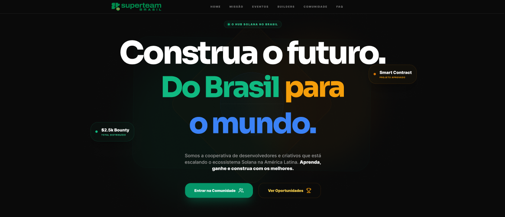

# Superteam Brazil 🇧🇷 - Landing Page Design

Premium dark-mode landing page design for **Superteam Brazil** — the official Solana builder hub in Brazil.

Figma design submission for the Superteam Brazil UI/UX Design Bounty.


*Replace with actual screenshot of your Figma hero section*

---

## 🔗 Important Links

- **[View Figma Design](your-figma-link-here)** (View Only)
- **[Design Presentation](your-notion-or-loom-link)** (Rationale & Walkthrough)
- **[Twitter Announcement](your-tweet-link)**

---

## 🎨 Design Overview

A modern Web3 landing page featuring **bold Brazilian identity** through dominant green and yellow colors, combined with premium glassmorphism effects and contemporary geometric abstraction.

### Key Features

✅ **10-Section Landing Page** (Desktop + Mobile)
- Hero with abstract Brazilian flag composition
- Mission with 6 pillar cards
- Animated impact metrics
- Events showcase
- Members preview with filters
- Ecosystem partners (tiered)
- Social proof wall
- FAQ accordion
- Join CTA
- Complete footer

✅ **Dedicated Members Directory** (Desktop + Mobile)
- Advanced search and filters
- Filter by role, skills, Brazilian cities
- Core Team distinction with gradient borders
- Responsive 4-column grid
- Skill badges with color coding

---

## 🇧🇷 Brazilian Identity Integration

**Color Palette:**
- 🟢 Verde (Green) `#10B981` - 40% (Primary)
- 🟡 Amarelo (Yellow) `#F59E0B` - 30% (Secondary)
- 🔵 Azul (Blue) `#3B82F6` - 20% (Tertiary)
- 🟣 Purple `#8B5CF6` - 10% (Superteam Global only)

**Cultural Approach:**
- 100% Portuguese localized copy (not translated)
- Modernist geometric abstraction (Niemeyer-inspired)
- References to São Paulo, Rio, Brasília
- "Do Brasil para o mundo" mindset
- Zero tourist clichés

---

## 📦 Figma Structure

### Pages Delivered:
1. **Cover + Index** - Project navigation
2. **Style Guide** - Brazilian color tokens, typography (PT), spacing, effects
3. **Component Library** - 50+ components with variants
4. **Landing Desktop** - 1440px, all 10 sections
5. **Landing Mobile** - 375px, responsive adaptations
6. **Members Desktop** - Full directory with filters
7. **Members Mobile** - Mobile-optimized experience
8. **Prototype** - Interactive flows

### Component Highlights:
- Buttons with Brazilian color states (Verde, Amarelo, Azul)
- Member cards (Standard + Core Team with tri-color gradient)
- Glassmorphism effects with Brazilian color tints
- Pillar cards with color-coded icons
- Filter pills with verde active states

---

## 🎯 Design Differentiators

**vs. Other Submissions:**

1. **Bold Brazilian Palette** - Green & yellow dominant (not subtle accents)
2. **Functional Filters** - Members filterable by Brazilian cities (SP, Rio, Brasília, etc)
3. **Core Team Distinction** - Gradient border (Verde → Amarelo → Azul)
4. **Tiered Partners** - Organized by Global/Ecosystem/Brazil 🇧🇷
5. **Authentic Portuguese** - Localized copy, not Google Translated
6. **Professional Figma** - Auto-layout, proper variants, complete style guide

---

## ✨ Technical Excellence

- ✅ Auto-layout on all components
- ✅ Organized naming: `Component/Variant/State`
- ✅ Responsive breakpoints (375px, 768px, 1440px)
- ✅ Complete style guide with Brazilian tokens
- ✅ Interactive prototype with key user flows
- ✅ Component library with 50+ reusable elements

---

## 📸 Preview Gallery

### Landing Page


### Members Directory


*Add actual screenshots from your Figma*

---

## 🏆 Bounty Criteria Alignment

| Criteria | Weight | Approach |
|----------|--------|----------|
| **Visual Design Quality** | 25% | Premium Web3 aesthetic + bold Brazilian palette |
| **UX & Navigation** | 25% | Intuitive flows + functional member discovery |
| **Completeness** | 20% | All 10 sections + dedicated Members page |
| **Responsiveness** | 15% | Desktop + mobile for both pages |
| **Cultural Relevance** | 10% | Green/yellow dominant + PT copy + zero clichés |
| **Presentation** | 5% | Clear rationale + design decisions explained |

**Target Score:** 9.5-10/10 🚀

---

## 📖 Design Philosophy

**Modern, not minimal**  
**Premium, not generic**  
**Dynamic, not static**  
**Brazilian, not cliché**  
**Professional, not corporate**

---

## 🛠️ Built With

- **Design Tool:** Figma
- **Design System:** Brazilian Web3 Modern
- **Typography:** Inter (UI), Space Grotesk (Display)
- **Language:** Portuguese (PT-BR)
- **Inspiration:** Oscar Niemeyer, Brazilian Modernism, Solana ecosystem

---

## 📞 Contact

**Designer:** [Your Name]  
**Twitter:** [@YourHandle](your-twitter)  
**LinkedIn:** [Your Profile](your-linkedin)  
**Email:** your@email.com

---

## 📄 License

© 2026 Superteam Brazil Design Submission. All rights reserved.

This design is submitted for the Superteam Brazil UI/UX Design Bounty and is intended for use by Superteam Brazil upon selection.

---

**Submission Date:** January 29, 2026  
**Bounty:** Superteam Brazil Landing Page Design  
**Tags:** @SuperteamBR @SuperteamEarn

Made with 💚💛 for Superteam Brazil 🇧🇷
```

---

## 📁 **Estrutura de Arquivos Recomendada no GitHub:**
```
superteam-brazil-design/
├── README.md                    (o código acima)
├── preview-hero.png            (screenshot do Hero)
├── preview-mission.png         (screenshot da Mission)
├── preview-members.png         (screenshot Members preview)
├── preview-members-full.png    (screenshot Members page)
├── preview-filters.png         (screenshot com filtros ativos)
├── presentation.pdf            (se fez PDF, opcional)
└── DESIGN-NOTES.md            (notas extras, opcional)
